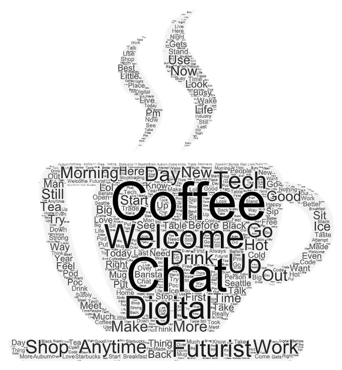
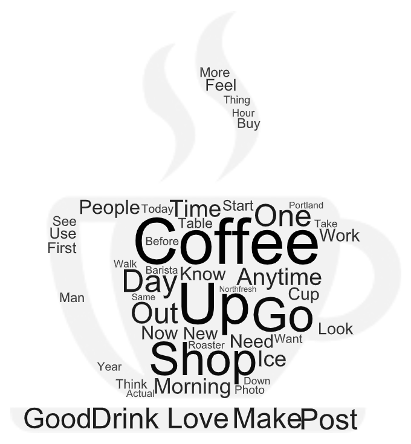
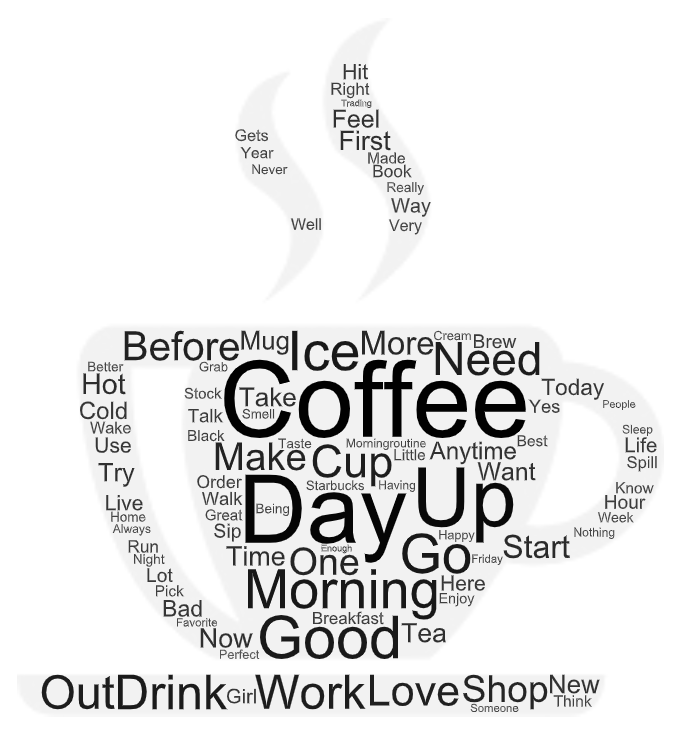

### Overview

This project explores how opinions surrounding coffee differ in major cities along the West Coast, specifically Seattle, Portland, and Los Angeles. In order to do this, I used a Twitter web crawler to identify tweets from a given location containing the search parameter "coffee." I then used this data to create word clouds for each city containing common words that appeared in the tweets. With Seattle being known for its coffee culture, I was curious to see if similar values were appreciated in major cities of the same region.

### Seattle

[Seattle Data](assets/twsearch-result-seattle.csv)

### Portland

### Los Angeles

### Reflection